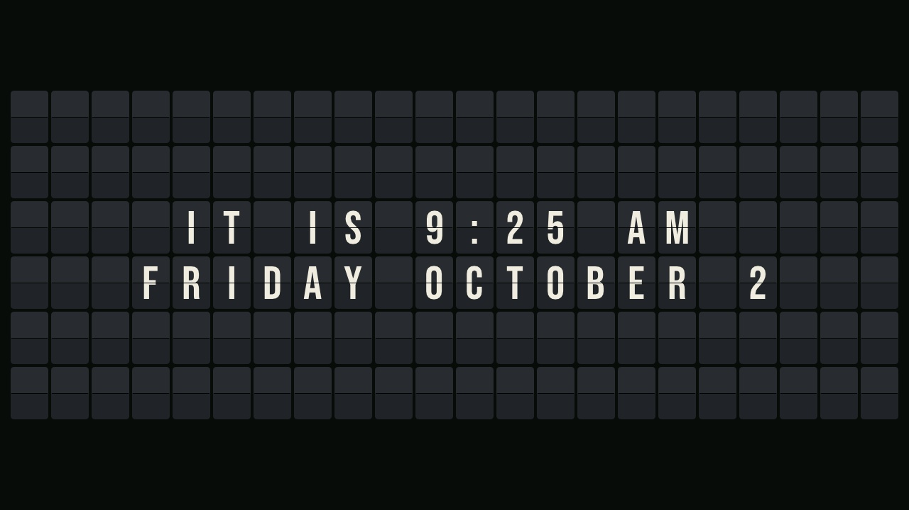

# FlapBoard

A split-flap sign for the [M5Stack Tab5](https://docs.m5stack.com/en/core/Tab5) (ESP32-P4, 1280x720).
Every cell turns through the drum in order, at a steady speed, with clacks, and stops one by one.
It shows messages from text files, a clock, the weather, or a photo slideshow, picks one by
schedule, and is set up entirely from a web page. It can switch itself on and off with the camera
as a motion sensor, drive a relay (for example the lights of a model railway car), and talks to
Home Assistant over MQTT.



Licence: GPL-3.0-or-later (see [LICENSE](LICENSE)). The fonts in `assets/fonts` are under the SIL
Open Font Licence, with their licence texts beside them.

## Install

**Web installer:** open the installer page in Chrome or Edge on a desktop, connect the Tab5 by
USB-C and click Install. This erases the Tab5.

**From a release:** `flapboard-<version>.bin` is the full image, flashed at offset 0:

```
esptool.py --chip esp32p4 write_flash 0 flapboard-0.9.0.bin
```

**From source:** [PlatformIO](https://platformio.org/), then `pio run -e app -t upload`.

### First start

Put in a microSD card formatted **FAT32** (exFAT, which most cards over 32 GB come with, is not
supported). The sign makes its folders on it.

The sign opens a Wi-Fi hotspot called **FlapBoard-XXXX**. Join it from a phone; the setup page
opens by itself. Pick your network and type its password. After that the sign is at
`http://flapboard.local/`, or at the address shown when you **press and hold anywhere on the
screen**. The info sheet that opens also has the brightness and volume controls, a QR code for the
web page, and buttons to switch between messages, clock, weather and photos.

## Using it

The web page has a tab for each part:

- **Status:** what is showing and why, volume, Wi-Fi, SD card, Home Assistant, firmware update,
  backup and restore, and recent activity.
- **Display:** rows and columns, cell size and spacing, font, colour theme, flip speed, and
  pictures beside the board. A live preview shows the layout before you save.
- **Messages:** what to show (message files, clock, weather, fixed text, photos), in what order and
  for how long. Messages can also be sent to show now, for a while or until cleared.
- **Photos:** the slideshow: all photos, a folder or a selection; random or by name or date;
  dissolve or cut; and an optional clock in a corner.
- **Schedule:** which program shows when, one-off dates, sleep hours, and the motion sensor.
  A rule that runs past midnight belongs to the day it started on.
- **Clock & weather:** time zone, NTP server, time and date formats, and the weather location
  ([Open-Meteo](https://open-meteo.com/), no key needed).
- **Files:** the SD card. Upload, download, rename, delete. Photos put in `photos/` are shrunk to
  the screen size in the browser before they go up.

### Message files

Files in `messages/` hold one message per paragraph (separate them with a blank line). Each line
is a row on the board. Text is upper-cased; letters, digits and `!@#$()-+&=;:'"%,./?°` are on the
drum, plus colour tiles written `{R}` `{O}` `{Y}` `{G}` `{B}` `{V}` `{W}` `{K}`.

```
# A comment
@center
DINING CAR OPEN
UNTIL 9:30 PM

@left @hold 60
NEXT STOP
{G}{G} OAK RIDGE {G}{G}
```

`@left`, `@right` and `@center` align the rows, `@top` puts them at the top instead of the middle,
`@hold N` keeps that message up N seconds, and a line with a lone `|` is an empty row.
Messages, the clock and the weather can use `{time}`, `{date}`, `{name}`, `{ip}` and
`{hostname}`; the weather adds `{place}`, `{temp}`, `{feels}`, `{hi}`, `{lo}`, `{hum}`, `{wind}` and `{cond}`.

### Sounds

The clacks are made by the sign itself. To use your own, put mono 16-bit WAV files named
`clack_*.wav` in `sounds/`.

## Home Assistant (MQTT)

Set the broker on the Status page. The sign announces itself by MQTT discovery as one device:
display on/off, message text, program select, volume, brightness, sound switch, a Next button, a
motion sensor, and diagnostics. Topics are under `flapboard/<id>/`, for example:

| Topic | Payload |
| --- | --- |
| `display/set` | `OFF` holds the display (and relay) off; `ON` releases it |
| `message/set` | text to show now, or `{"text": "...", "seconds": 30}`; empty clears it |
| `show/set` | `Messages`, `Clock`, `Weather`, `Fixed message` or `Photos` |
| `volume/set`, `brightness/set` | 0-100 |
| `sound/set` | `ON` or `OFF` |
| `next/press` | anything: shows the next message or photo |

## Relay output

A relay follows the display: on when the sign is on, off when it sleeps, is held off, or motion
times out. Set the pin on the Schedule page (Screen and lights) and use the test button there.

The easiest connection is the Tab5's **Port A** (the red Grove socket): red is **5 V**, black is
**GND**, yellow is **G53** and white is **G54**. Port A's 5 V is switched on only while a relay pin
is configured. Use a relay **module** (with its own transistor or opto-isolator), never a bare
relay coil on a GPIO pin. The pins are 3.3 V logic. Most small modules take 5 V on VCC and switch
on a 3.3 V input; many switch when the input is pulled *low*, in which case turn off "active high".
If the lights run on mains voltage, the module must be rated for it and enclosed.

## Firmware updates and backups

**Status > System > Update firmware** takes `flapboard-<version>-update.bin` from a release and
keeps all settings and files. A new firmware runs on trial: if it cannot start and join Wi-Fi,
the next restart goes back to the old one by itself.

**Download backup** saves the settings and message files as one JSON file. Wi-Fi and MQTT
passwords and photos are not included. **Restore backup** puts them back, on this sign or another.

## Building

- `pio run -e app`: the firmware. The web pages, fonts, sounds and time zone table are embedded
  at build time by `tools/embed_web.py`.
- `pio test -e native`: the tests for the parts that do not need the hardware.
- `tools/release.sh`: release images in `dist/` and the web installer in `site/`.
- For development, `include/secrets.h` (gitignored) can hold `WIFI_SSID` and `WIFI_PASSWORD`
  to skip the setup hotspot; release builds leave it out.

The board drawing, drum, flap motion, layout, themes and clack mixer live in `lib/flapcore`,
which has no Tab5 code in it and can be used in other projects. `docs/hardware.md` has the
measurements and the lessons learned on the Tab5 (memory, the Wi-Fi coprocessor, the camera).

## Credits

Built on [M5Unified/M5GFX](https://github.com/m5stack/M5Unified),
[ArduinoJson](https://arduinojson.org/), [stb_truetype](https://github.com/nothings/stb), and
the [pioarduino](https://github.com/pioarduino/platform-espressif32) ESP32 platform. Fonts:
Bebas Neue and Anton (OFL). Weather by [Open-Meteo](https://open-meteo.com/).
